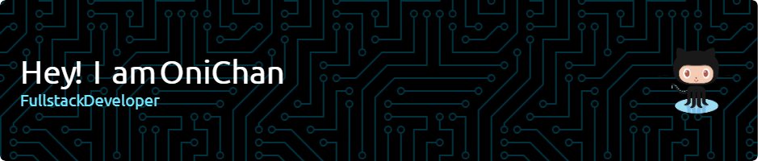

### Hi there 👋, Welcome to my profile.

Hey, I'm Farhan Ahmad, also known as Onichan. I'm a 16-year-old college student who caught the coding bug at 13. Python's my trusty sidekick, and I'm tinkering with HTML, CSS, and JS to add some creativity. I'm diving into the fascinating world of AI and ML, eager to unravel their complexities. Currently venturing into the realms of web development and rust.

Skills: Python / Rust / Javascript / HTML / CSS

- 🔭 I’m currently working on this page.
- 🌱 I’m currently learning Web Development

